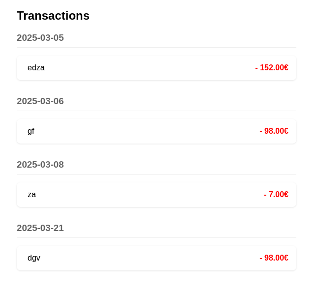
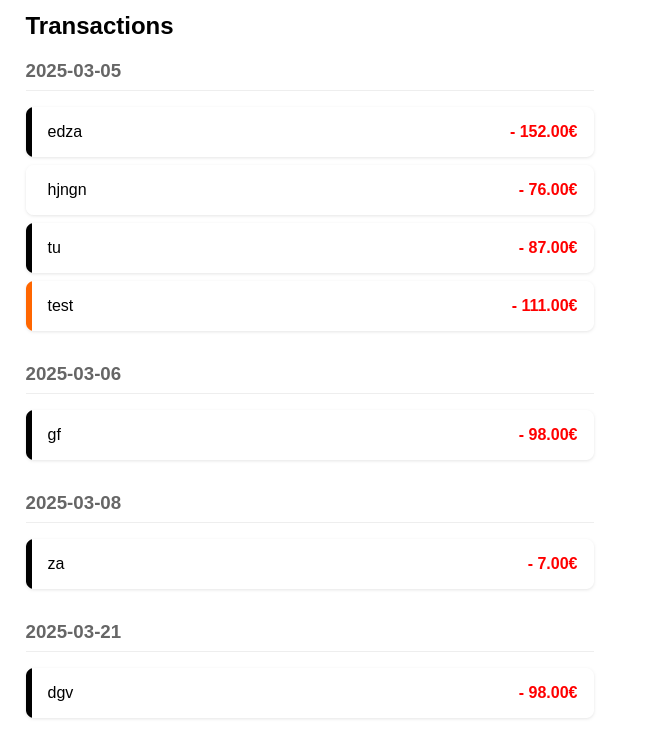
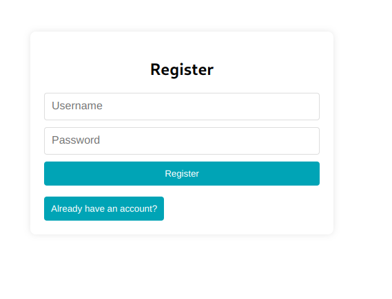

### Brief 18 :

1- Nous avons identifié que si l'utilisateur n'avait pas de compte lors de la connexion, le chargement va continuer jusqu'au timeout.
```js
  const handleSubmit = useCallback(async (e) => {
    e.preventDefault();
    setAuthLoading(true);
    setError('');
    
    const success = isLogin 
      ? await login(username, password)
      : await register(username, password);
    
    if (!success) {
      setError(isLogin ? 'Login failed' : 'Registration failed');
    }
    setAuthLoading(false);

  }, [isLogin, username, password, login, register, setAuthLoading]);
```
```js
      <button onClick={() => setIsLogin(!isLogin)}>
        {isLogin ? 'Need to register?' : 'Already have an account?'}
      </button>
```

On apporte quelques modifictions:
- On fait en sorte qu'en cliquant sur 'login', s'il y a une erreur côté serveur, le chargement va se transformer en message d'erreur.

```js
 const handleSubmit = useCallback(async (e) => {
    e.preventDefault();
    setAuthLoading(true);
    setError('');

    try {
      if (isLogin) {
        await login(username, password);
      } else {
        await register(username, password);
      }
    } catch (error) {
      console.error(isLogin ? 'Login failed:' : 'Registration failed:', error);
      setError(isLogin ? 'Login failed' : 'Registration failed');
    } finally {
      setAuthLoading(false);
    }
  }, [isLogin, username, password, login, register]);
```

- Nous avons rendu le changement entre 'login' et 'register' plus explicite et 'user-friendly', c'est-à-dire en nettoyant les champs après le changement de mode.

```js
 <button onClick={toggleMode}>
    {isLogin ? 'Need to register?' : 'Already have an account?'}
</button>
```
```js
 const toggleMode = () => {
    setIsLogin((prev) => !prev);
    setError('');
  };
```

2- Nous avons identifié qu'au rechargement de page, l'utilisateur se trouve obligé de se reconnecter.
- Nous avons stocké le token de l'utilisateur dans le session storage pour que le navigateur se souvienne de l'utilisateur.

```js
  const saveTokenToStorage = (data) => {
    if (data && data.accessToken) {
      sessionStorage.setItem('userToken', data.accessToken);
      sessionStorage.setItem('userData', JSON.stringify(data));
    }
  };

  const removeTokenFromStorage = () => {
    sessionStorage.removeItem('userToken');
    sessionStorage.removeItem('userData');
  };
```

```js
 useEffect(() => {
    const checkExistingSession = async () => {
        try {
            const storedToken = sessionStorage.getItem('userToken');

            if (storedToken) {
                const userData = await loginService.validateToken(storedToken);

                setAuth(userData);
            }
        } catch (error) {
            removeTokenFromStorage();
        } finally {
            setIsLoading(false);
        }
    };

    checkExistingSession();
}, []);
```
```js

export async function validateToken(token) {
    return apiRequest('/api/auth/validate', {
        method: 'GET',
        headers: {
            'Authorization': `Bearer ${token}`
        }
    });
};
```
```java

    @GetMapping("/validate")
    public ResponseEntity<JwtAuthenticationResponse> validateToken(
            @RequestHeader("Authorization") String authorizationHeader
    ) {
        String token = authorizationHeader.substring(7);

        try {
            String username = tokenProvider.getUsernameFromJWT(token);

            if (tokenProvider.validateToken(token)) {
                User user = userRepository.findByUsername(username)
                        .orElseThrow(() -> new UsernameNotFoundException("User not found"));

                return ResponseEntity.ok(
                        new JwtAuthenticationResponse(token, user.getId(), user.getUsername())
                );
            }
            return ResponseEntity.status(HttpStatus.UNAUTHORIZED).build();
        } catch (Exception e) {
            return ResponseEntity.status(HttpStatus.UNAUTHORIZED).build();
        }
    }
```

3 - Nous avons identifié que la liste des transactions n'était pas triée par ordre chronologique mais par ordre de création des transactions. Cela peut être confusant pour l'utilisateur.
- Nous avons donc ajouté un tri par date dans notre composant TransactionsList
- 
```js
{Object.entries(groupedTransactions).sort().map(([date, transactions]) => (
    <div key={date} className="date-group">
        <h3>{date}</h3>
        {transactions.map(transaction => (
            <div key={transaction.id} className="transaction-item">
                <div
                    className="category-color-indicator"
                    style={{ backgroundColor: getCategoryColor(transaction.categoryId) }}
                />
                <div className="transaction-content">
                    <div className="transaction-title">{transaction.title}</div>
                    <div className="transaction-amount">- {formatAmount(transaction.amount)}€</div>
                </div>
            </div>
        ))}
```

4 - Nous avons identifé que le montant des transactions n'avait pas de couleur distincte qui évoque un retrait d'argent.
-Nous avons changé la couleur du texte en rouge et ajouté un signe "moins" avant le montant.

```css
.transaction-amount {
  font-weight: bold;
  color:  #FF0000;
}
```

```jsx
<div className="transaction-amount">- {formatAmount(transaction.amount)}€</div>
```



5 - Nous avons remarqué que lorsque l'on ajoute une nouvelle catégorie mais que l'on ne sélectionne pas de couleur particulière, la couleur par défaut est noire, rendant la lisibilité du texte impossible.
-Nous avons changé la couleur par défaut pour la mettre blanche

```jsx
  const [formData, setFormData] = useState({
    name: '',
    color: '#ffffff',
    limit: ''
});
```

6 - Nous avons remarqué que les couleurs associées aux catégories n'étaient pas utilisées au sein de l'application.
- Nous avons récupéré les couleurs des catégories associées aux transactions pour afficher une bande de couleur à gauche.

```jsx
<div
    className="category-color-indicator"
    style={{ backgroundColor: transaction.categoryColor}}
/>
```



7 - Nous avons remarqué que le bouton logout n'était en réalité pas un bouton, il n'y avait donc pas de curseur : ce qui pourrait induire l'utilisateur en erreur.
- Nous avons remplacé la div par un bouton 
```jsx
      <button onClick={logout}>Logout</button>
```

8 - Nous avons remarqué que le menu n'était pas accessible sur mobile.
- Nous avons ajouté un menu burger pour la version mobile.

```jsx
        <CiMenuBurger onClick={handleMenuBurger} aria-label={"bouton menu burger"} className="menu-burger"/>
```

```jsx
  const handleMenuBurger = () => {
    const navLinks = document.querySelector('.nav-links');
    setIsOpen(prevIsOpen => !prevIsOpen);
  }
```

```css
@media (max-width: 600px) {
  .menu-burger {
    display: initial;
    color: #1a73e8;
  }

  .nav-links {
    width: 0px;
    overflow: hidden;
  }

  .navbar {
    max-height: 4rem;
    margin: 0;
  }

  .inactive {
    display: flex;
    flex-direction: column;
    gap: 1rem;
    background-color: lightslategrey;
    position: relative;
    top:8.5rem;
    width: 100%;
    left: 2.7rem;
    padding: 1rem;
    border-radius: 5px;
  }

  .inactive a {
    text-decoration: none;
    color: white;
  }
}
```

9 - Nous avons espacé et changé le contraste des boutons sur les pages de login et register



